# Drafter & Design Lab Requirements (FR-5.0)

This document outlines the functional and non-functional requirements for the "Drafter" (Editor), "Notebook Management", and "Design Lab" features, as derived from the `drafter.html` wireframe.

## 1. Visual & Aesthetic Requirements (Customizable Interface)
- **Design Lab Sovereignty**: Users must be able to override the default "Quest" theme via the Design Lab.
- **Dynamic CSS Variables**: The application must use CSS variables (`--background`, `--foreground`, `--primary`, `--secondary`, `--card`, `--radius`, `--font-size`) for real-time interface updates.
- **Pixel Grid Overlay**: A low-opacity pixel-grid overlay should persist across all views to maintain the retro aesthetic.
- **Iconography**: Standardized use of `Lucide` icons across buttons and navigation.

## 2. Global Navigation & Sidebar (FR-5.1)
- **Context-Aware Sidebar**:
    - **Editor Mode**: Displays Word Count and persistent Save button.
    - **Global**: Displays Alice (Tutor) status and primary navigation (Editor, Notebooks, Settings).
- **Alice Status Indicator**:
    - Visual emoji/status changes based on user inactivity:
        - `Reading` (📖): Active typing.
        - `Checking` (👀): 10-20 seconds of inactivity.
        - `Helping` (✋): >20 seconds of inactivity.
- **Breadcrumb Header**: Displays the current location (e.g., `Home / Story Title` or `Notebooks / Characters`).

## 3. The Drafter (Editor) Requirements (FR-5.2)
- **Collapsible Story Header**:
    - Allows users to hide metadata fields (Title, Font, Genre) to maximize vertical writing space.
    - Displays a "Collapsed Title" summary when hidden.
- **Story Metadata**:
    - **Title**: Real-time update of breadcrumbs and state.
    - **Typography**: Quick-change font selection within the editor for immediate readability adjustment.
    - **Genre & Archetype**: Selection of story "Type" and "Plot Structure" (e.g., Fantasy / Hero's Journey).
- **Writing Area**:
    - High-contrast, focused writing space using the `Lexend` or user-selected font.
    - Visual cues (e.g., ghosted dragon icon) in the background to inspire the theme.
- **Word Counting**: Real-time word count calculation and display in the sidebar.

## 4. Design Lab (Settings) Requirements (FR-5.3)
- **Color Mixer**: Interactive color input for setting the core palette of the app.
- **Typography Station**:
    - **Font Families**: Specific groupings for "Game Styles", "Inclusive/Accessibility", and "Creative".
    - **Size Slider**: Range from 12px to 24px with real-time scaling of the UI.
- **Shape Shifter**: Toggle between `0px` (Pixel/Blocky) and `12px` (Modern/Round) border-radii.

## 5. Notebook Management Requirements (FR-5.4)
- **Repository Types**:
    - **System Repos**: Pre-defined, un-deletable collections for Characters and Places.
    - **User Repos**: Custom notebooks created by the child writer.
- **Grid Layout**: Card-based view showing entry counts and last-edited timestamps.
- **Depth/Detail View**: Ability to drill down into a notebook and see entries (implemented as "empty state" placeholder in wireframe).

---

## 6. Process Workflows (Mermaid Diagrams)

### Workflow 1: Design Lab Customization

### Workflow 2: Writing & AI Monitoring

```mermaid
graph TD
    A[User Typing in Editor] --> B{Activity Timer}
    B -- Keystroke --> C[State: Reading 📖]
    B -- 15s Idle --> D[State: Checking 👀]
    B -- 30s Idle --> E[State: Helping ✋]
    E --> F[Trigger Offer Help UI]
    C --> G[Update Word Count]
    G --> H[Check Save State]
```

### Workflow 3: Notebook Navigation

### Workflow 4: Editor Header Management

