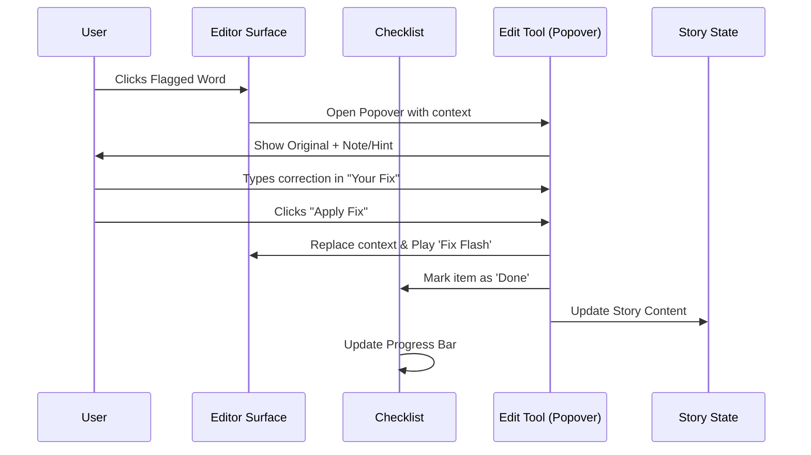
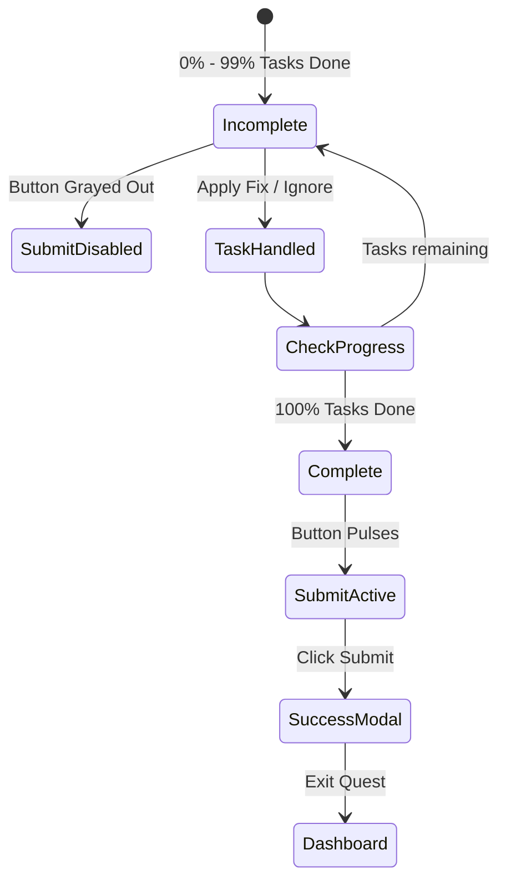
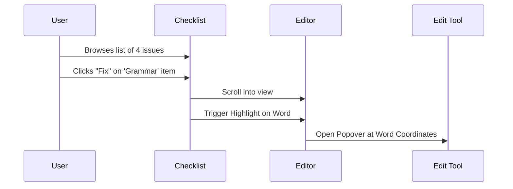

# Edit Phase Requirements (FR-8.0)

This document outlines the functional and non-functional requirements for the "Edit" (Polishing Station) feature, as derived from the `editor.html` wireframe.

## 1. Visual & Aesthetic Requirements (The Crafting Station)
- **High-Focus Workspace**: The editing area should resemble a clean sheet of paper with subtle grid/lines, distinct from the drafting phase to indicate a shift in mindset.
- **Flagged State Indicators**:
    - Inherits visual flags from the "Review" phase (Spelling, Grammar, Repetition).
    - Features a specific "Note" indicator (Blue tint + 📝) for user-authored sticky notes.
- **Fix Animation**: Successfully edited words should "flash" green (`item-fixed`) to provide positive reinforcement.
- **Checklist Sidebar**: A persistent list of remaining tasks (flags and notes) to be addressed.

## 2. The Edit Checklist (FR-8.1)
- **Task Aggregation**: Automatically populates a list based on all flags identified in the "Review" phase and any custom notes created.
- **Categorization**: Items in the checklist display their type (e.g., "Spelling", "My Note") and a snippet of the original text.
- **Progress Tracking**:
    - A visual progress bar that fills as tasks are completed.
    - Status text showing completion ratio (e.g., "2/4 Fixed").
- **Direct Navigation**: Clicking a checklist item should highlight the corresponding word in the editor and open the edit tool.

## 3. The Polishing Station Workflow (FR-8.2)
- **Edit Toolkit (Popover)**:
    - Opens upon clicking a flagged word or checklist item.
    - **Contextual Data**: Displays the original text and any associated notes (e.g., Alice's hint or user's note).
    - **Correction Input**: A focused text field for typing the final fix.
- **Action Options**:
    - **Apply Fix**: Replaces the text in the story, marks the task complete, and removes the flag styling.
    - **Ignore**: Removes the flag styling and marks the task as "reviewed" without changing the text (respecting the author's choice).
- **Persistence**: Edits must update the main `Story.Content` blob across the application.

## 4. Completion & Submission (FR-8.3)
- **Gatekeeping**: The "Submit to Teacher" (or Finish) button remains disabled/faded until all checklist items are addressed (fixed or ignored).
- **Polished State**: The button enters an "Active" (pulse) state once the checklist is 100% complete.
- **Success Modal**: A celebratory dialog confirming submission and providing a clear path back to the next writing phase or dashboard.

---

## 5. Process Workflows (Mermaid Diagrams)

### Workflow 1: Turning a Flag into a Fix


### Workflow 2: Addressing a Personal Note
```mermaid
graph TD
    A[User Sees 📝 Indicator] --> B[Clicks Note Icon]
    B --> C[Open Tool: "My Note" Mode]
    C --> D[Read custom note content]
    D --> E{Action?}
    E -- Apply Fix --> F[Update word & clear note]
    E -- Ignore --> G[Remove note & keep text]
    F --> H[Update Checklist & Progress]
    G --> H
```

### Workflow 3: Final Submission Gate


### Workflow 4: Checklist Linkage

