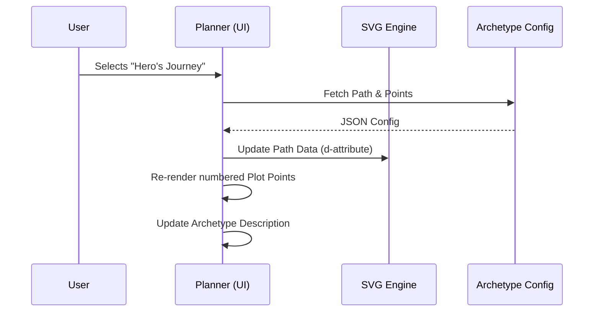
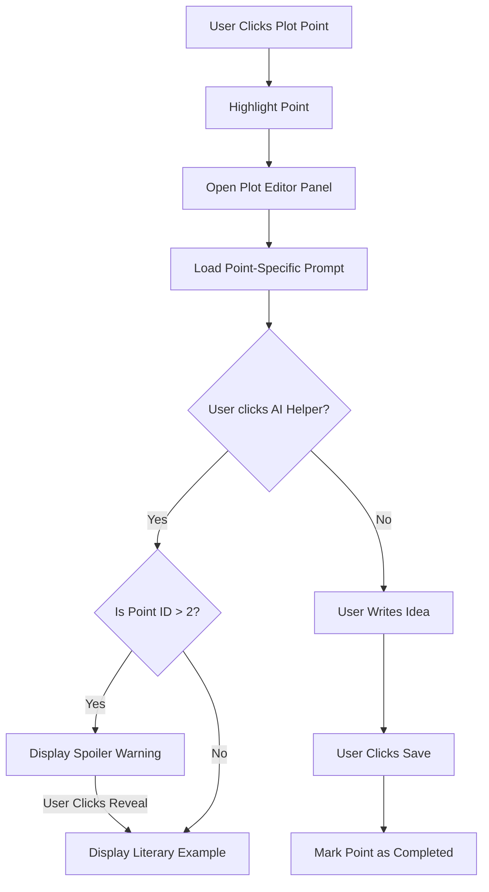
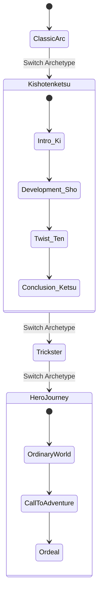
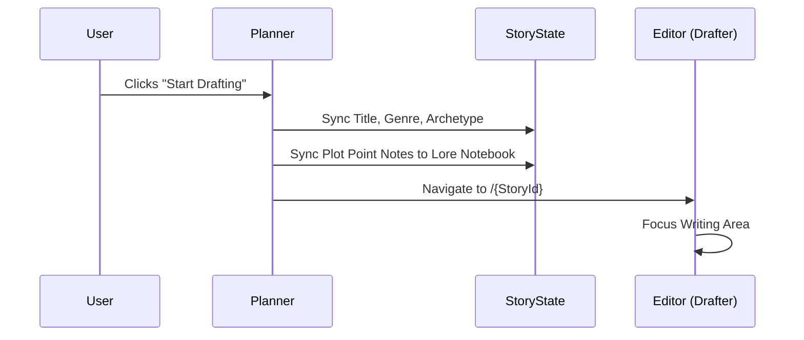

# Story Planner Requirements (FR-6.0)

This document outlines the functional and non-functional requirements for the "Story Planner" feature, as derived from the `planner.html` wireframe.

## 1. Visual & Aesthetic Requirements (The Planning Quest)
- **Workflow Theming**: Use a "Plot Mountain" metaphor for the main workspace.
- **Consistent Icons**: Integration of `Lucide` icons with pixel-art styling.
- **Micro-animations**: "Start Drafting" button should feature a persistent "bounce" to encourage progression.
- **Responsive Pathing**: The SVG mountain path must scale horizontally to fit the workspace while maintaining relative point positions.

## 2. Global Workflow Navigation (FR-6.1)
- **Numbered Phases**: A sidebar representing the writing lifecycle:
    1.  **Plan** (Active)
    2.  **Draft** (Accessible)
    3.  **Review** (Locked)
    4.  **Edit** (Locked)
- **Connection Lines**: Visual vertical lines connecting workflow steps in the sidebar to reinforce the sequential nature of the process.
- **Phase Locking**: Prevent navigation to "Review" or "Edit" until pre-requisite conditions (e.g., word count thresholds) are met.

## 3. Story Basics Functional Requirements (FR-6.2)
- **Metadata Capture**: 
    - Text inputs for Story Title and Protagonist.
    - Select menus for Genre and Archetype.
- **State Synchronization**: Changes to the Story Title in the Planner should update the global `StoryState` and breadcrumbs.

## 4. The Plot Map (FR-6.3)
- **Archetype Switching**:
    - Support for multiple plot structures: 
        - **Western Classic**: Freytag's Pyramid, Hero's Journey, Quest.
        - **Global Traditions**: Kishōtenketsu (The Twist), Trickster's Tale, Collective Journey, Jo-Ha-Kyū (The Waterfall), Frame Story.
    - Switching archetypes must dynamically redraw the SVG path and reposition plot points.
- **Interactive Points**:
    - Points are rendered as numbered circles along the mountain path.
    - **Hover Effect**: Scales the point for clarity.
    - **Selection State**: Highlights the point and opens the "Plot Editor" below.
    - **Completed State**: Changes the point color (Secondary/Pink) once text has been entered and saved.

## 5. Plot Editor & AI Support (FR-6.4)
- **Contextual Prompts**: Each plot point in an archetype must provide a specific brainstorming prompt (e.g., "What is the Call to Adventure?").
- **AI Helper (Literary Examples)**:
    - Provides a "Literary Example" for the selected point (e.g., how Dorothy's house flying in *The Wizard of Oz* fits the 'Inciting Incident').
    - **Spoiler Protection**: If a user asks for help on points 3+ (Climax/Resolution), display a "Spoiler Alert" warning that requires a click to reveal, preventing accidental ruin of the story structure.

## 6. Progression Workflow (FR-6.5)
- **Drafting Handoff**: A prominent "Start Drafting" button that transitions the user into the `Editor.razor` (Drafter) view, carrying over all planned metadata.

---

## 7. Process Workflows (Mermaid Diagrams)

### Workflow 1: Archetype Redrawing

### Workflow 2: Investigating a Plot Point

### Workflow 3: Multi-Tradition Planning

### Workflow 4: Handoff to Drafting

