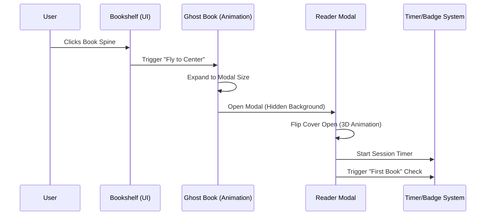
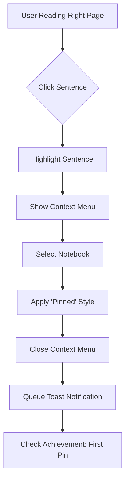
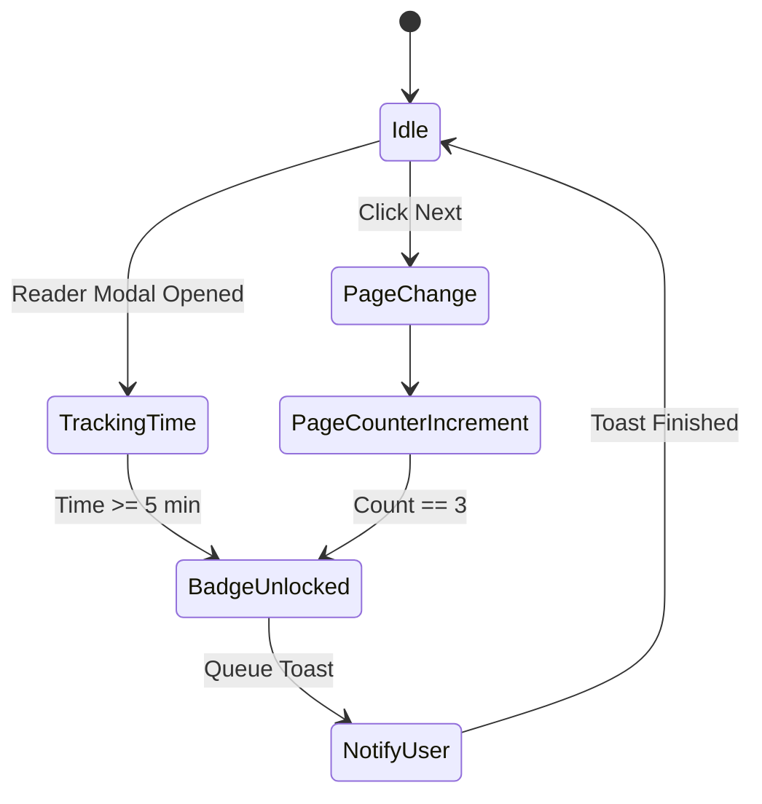
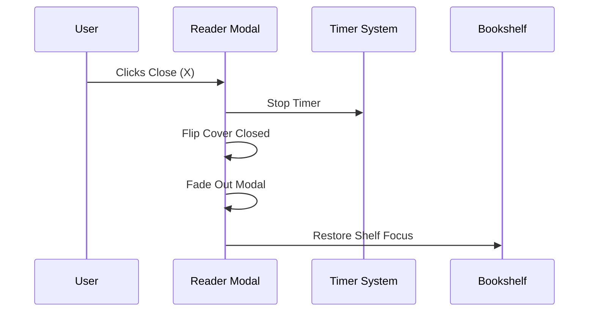

# Immersive Reader & Bookshelf Requirements (FR-4.0)

This document outlines the functional and non-functional requirements for the "Bookshelf" and "Immersive Reader" features, as derived from the `reader.html` wireframe.

## 1. Visual & Aesthetic Requirements (The "Quest" Theme)
- **Pixel-Art Aesthetic**: The UI must maintain an 8-bit/retro gaming aesthetic using pixelated borders, specific Google Fonts (`Press Start 2P`, `Silkscreen`, `Pixelify Sans`), and a pixel-grid background overlay.
- **Dynamic Bookspines**: Books on the shelf should have randomized or metadata-driven heights, widths, and slight "tilt" rotations to simulate a real bookshelf.
- **Theming**: Support for color-coded genres/books (e.g., `book-blue`, `book-pink`, `book-brown`) that transition into the reader's cover and page borders.

## 2. Bookshelf Functional Requirements (FR-4.1)
- **Library Display**: Render a collection of "Classic Stories" (read-only content) across multiple shelf rows.
- **Hover Effects**: Bookspines should translate upward and scale slightly on hover to indicate interactability.
- **Responsive Layout**: The shelf units should center within the main content area and remain legible on various screen sizes.

## 3. Immersive Reader Functional Requirements (FR-4.2)
- **The "Ghost Book" Animation**:
    - Upon clicking a book spine, a transition element (Ghost Book) must fly from the spine's position to the center of the screen.
    - The element should expand from spine-dimensions to cover-dimensions during flight.
- **3D Cover Flip**:
    - The reader modal must feature a 3D transform animation where the front cover flips 140 degrees to the left to "open" the book.
- **Dual-Page Layout**:
    - **Left Page (Metadata)**: Displays Title, Author, Chapter, and a visual page counter.
    - **Right Page (Content)**: Displays the text content.
- **Interactive Sentences (Research Workflow)**:
    - Text must be parsed into interactive spans (sentences).
    - **Hover State**: Sentences highlight (yellow background) when hovered.
    - **Selection State**: Clicking a sentence opens a context menu and applies a "persistent" highlight.
- **Context Menu (Pinning)**:
    - Allows the user to "Pin" a selected sentence to a specific Notebook (e.g., Characters, Places).
    - Pinned sentences should receive a visual indicator (e.g., a "pinned" icon or specific border-bottom).
- **Pagination**:
    - Smooth transition between pages with `Prev` and `Next` buttons.
    - Navigation should update the metadata (page counter) on the left page.

## 4. Gamification & Feedback (FR-4.3)
- **Toast Notifications**:
    - Standard toast for "Saved to Notebook".
    - Specialized "Badge Unlocked" toast with a distinct color (Secondary/Pink) for achievements.
- **Achievement/Badge System**:
    - **Bookworm Beginnings**: Awarded on first book open.
    - **Research Assistant**: Awarded on first sentence pinned.
    - **Page Turner**: Awarded after 3 pages are read.
    - **Deep Reader**: Awarded after a specific duration (e.g., 5 minutes) of continuous reading in the modal.

## 5. Technical Requirements
- **State Persistence**: Track symbols/sentences pinned by the user and link them to their notebooks.
- **Timer Management**: A background timer must track active reading time within the modal for achievement triggers.
- **JS Interop**: Use JavaScript for complex 3D CSS animations and scroll-position tracking that Blazor cannot handle natively.

---

## 6. Process Workflows (Mermaid Diagrams)

### Workflow 1: Opening a Book

### Workflow 2: Research & Pinning

### Workflow 3: Achievement Processing

### Workflow 4: Closing the Reader

