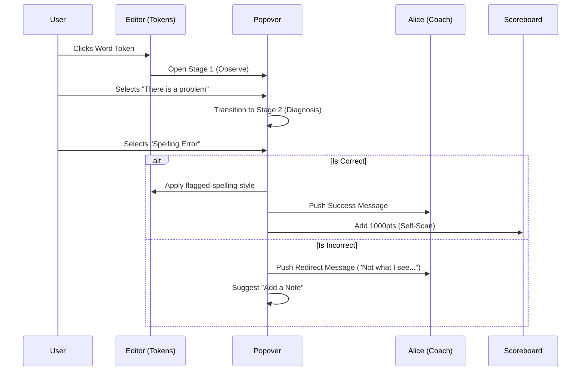
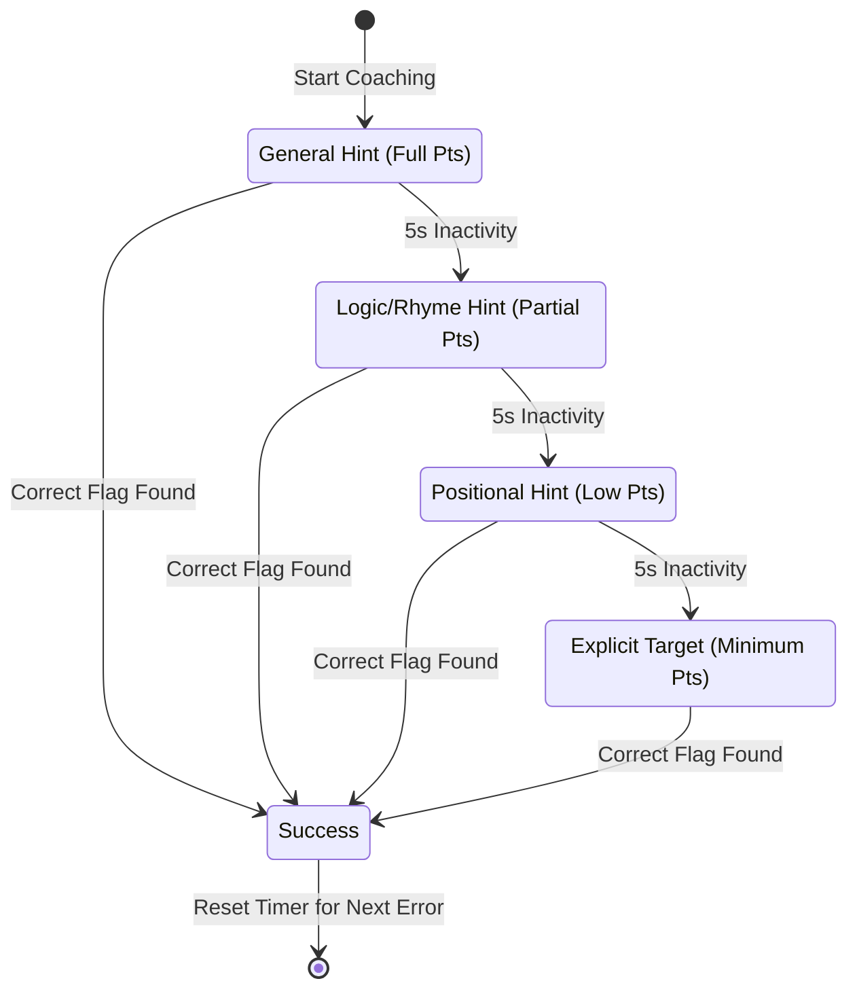
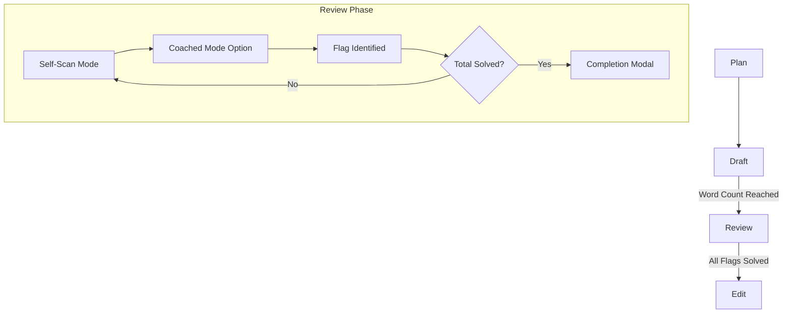
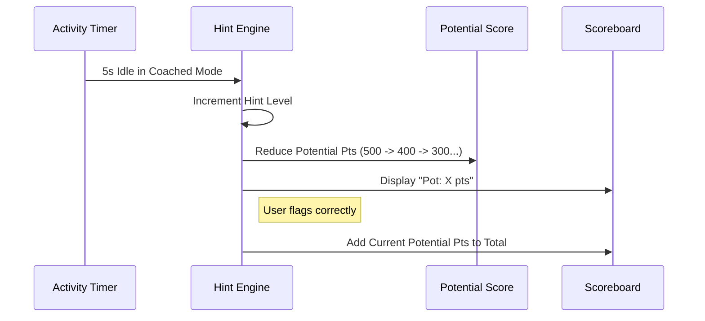

# Review Phase Requirements (FR-7.0)

This document outlines the functional and non-functional requirements for the "Review" (Editor's Eye) feature, as derived from the `reviewer.html` wireframe.

## 1. Visual & Aesthetic Requirements (The Gamified Review)
- **Word Tokenization**: Story text must be rendered as individual, interactive "tokens" (spans) rather than a block of text, allowing for granular selection and tagging.
- **Visual Feedback (Color Coding)**:
    - **Spelling**: Orange underline/tint.
    - **Grammar/Meaning**: Purple underline/tint.
    - **Repetition**: Green underline/tint.
    - **User Notes**: Blue underline/tint with a 📝 emoji indicator.
- **Scoreboard**: A retro-terminal styled "Score Board" that tracks points earned through successful identification of errors.
- **Alice's Coaching Pane**: A dedicated chat-style sidebar for hints and feedback.

## 2. Review Modes & Scaffolding (FR-7.1)
- **Self-Scan Mode (default)**: Children look for errors without assistance. High point rewards (e.g., 1000pts).
- **Coached Mode**: Alice provides escalating hints (Level 1 to 4) when the user is stuck.
    - Point rewards decrease as hint levels increase (e.g., 500pts -> 100pts).
- **Mode Badge**: Clearly indicates the current phase (e.g., "SELF-SCAN MODE" vs "COACHED MODE").

## 3. The "Editor's Eye" Workflow (FR-7.2)
- **Interactive Observation (Two-Stage Scaffolding)**:
    - **Stage 1 (Observation)**: Clicking a word opens a popover asking "Is there a problem?" or "Add a Note". This prevents premature diagnosis and encourages "noticing".
    - **Stage 2 (Diagnosis)**: If a problem is identified, the user must select the *type* of error (Spelling, Grammar, or Repetition).
- **Correct Diagnosis**: 
    - Applies the corresponding visual style.
    - Triggers a "Good Eye!" chat message from Alice.
    - Adds to the Scoreboard.
- **Incorrect Diagnosis**: 
    - Triggers a gentle redirection message ("That's not the one I was thinking of...").
    - Suggests adding a note if the user sees something else they want to change.

## 4. AI Coaching & Dynamic Hints (FR-7.3)
- **Escalating Hint System**:
    - **Level 1**: General nudge (e.g., "Look for a word repetition").
    - **Level 2**: Categorical/Rhyming clue (e.g., "Rhymes with 'Bark'").
    - **Level 3**: Positional clue (e.g., "It's in the second sentence").
    - **Level 4**: Specific target (e.g., "Look at 'dark'...").
- **Nudge Logic**: Hints should be pushed automatically in Coached Mode after a period of inactivity.

## 5. Review Completion (FR-7.4)
- **Progress Tracking**: Tracks specific solved errors (e.g., Repetition, Spelling, Grammar).
- **Review Complete Modal**: Triggered when all designated major issues have been flagged.
- **Transition to Edit**: Unlocks the "Edit" phase in the workflow sidebar.

---

## 6. Process Workflows (Mermaid Diagrams)

### Workflow 1: The Investigation Loop

### Workflow 2: Coached Mode Hint Escalation

### Workflow 3: Transitioning Between Workflow Phases

### Workflow 4: Scoring and Hint Penalty

