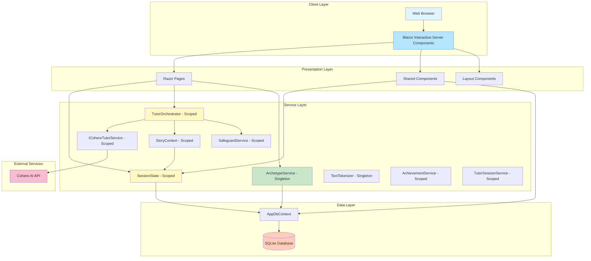
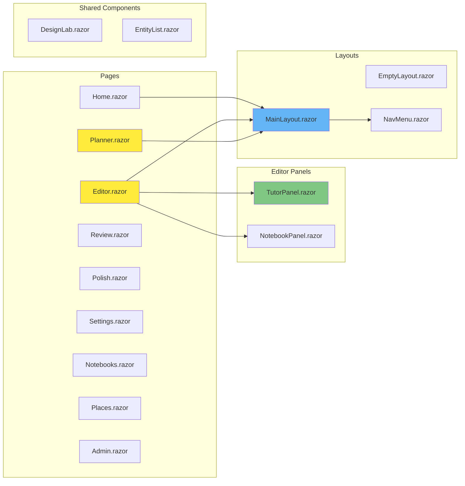
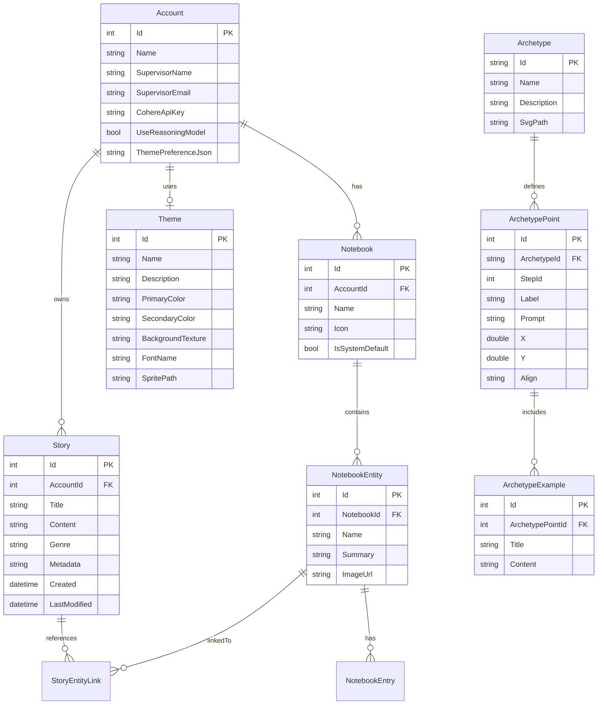
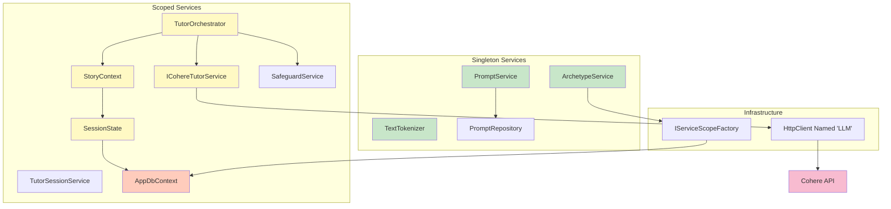
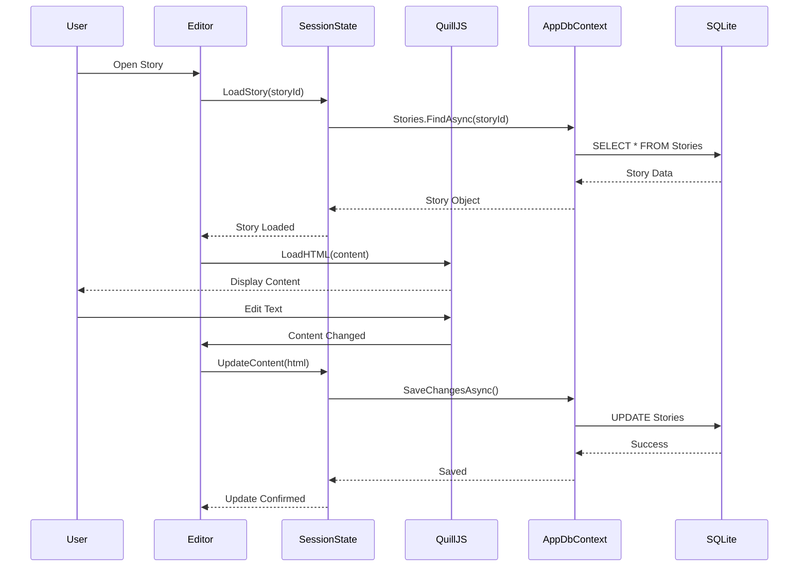
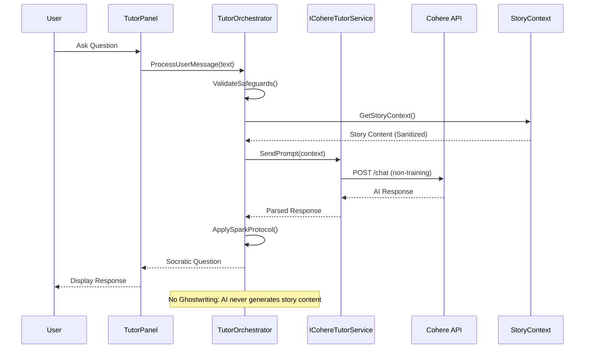
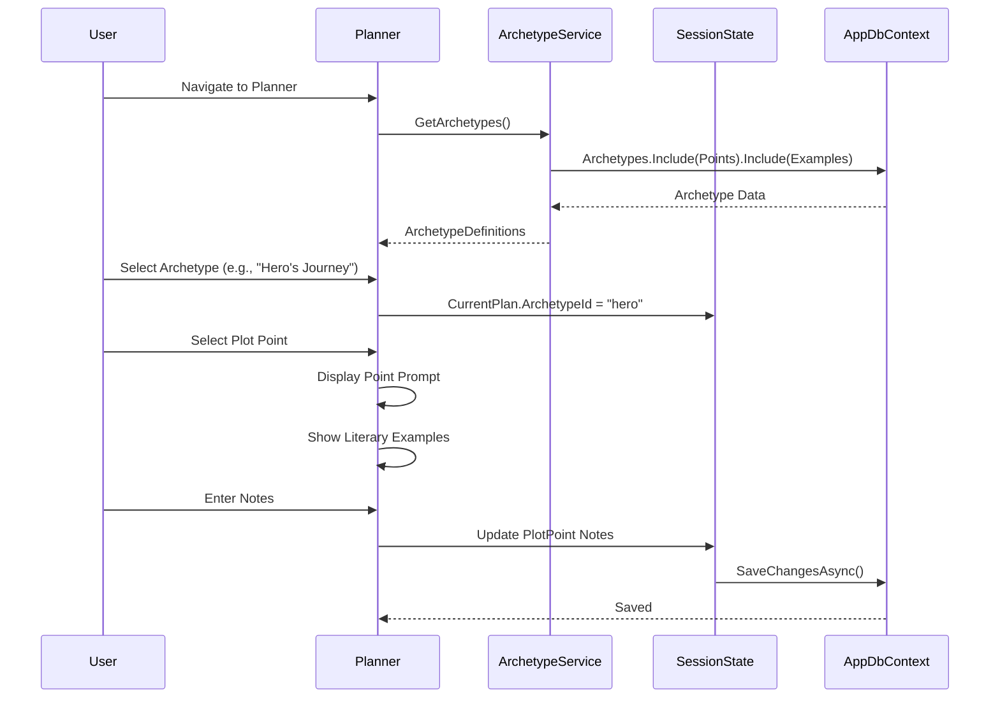
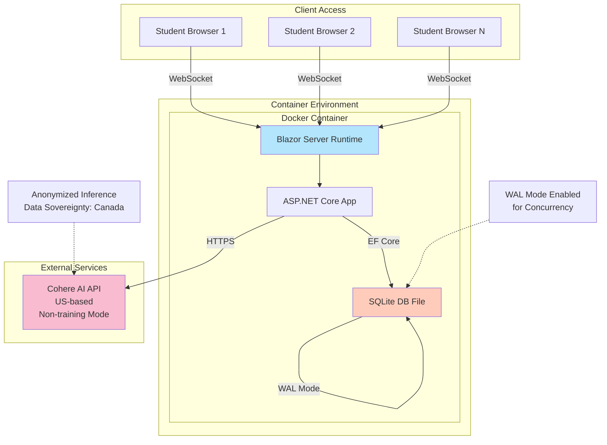
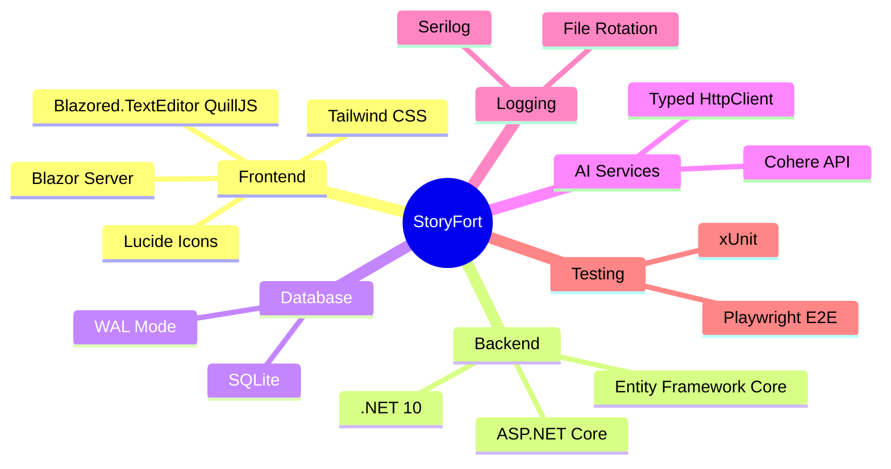
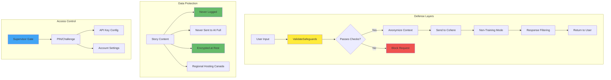

# StoryFort Architecture Diagram

## System Overview

This document provides a visual representation of the StoryFort architecture, including the component structure, data flow, and service dependencies.

## High-Level Architecture

## Component Structure

## Data Model

## Service Dependencies

## Request Flow: Story Editing

## AI Tutor Flow

## Archetype System Flow

## Deployment Architecture

## Key Design Patterns

### 1. **Scoped State Management**
- [`SessionState`](StoryFort/Services/SessionState.cs) acts as the session-level cache for the active story, notebooks, and tutor context
- [`StoryContext`](StoryFort/Services/StoryContext.cs) provides structured context to the AI orchestrator
- Prevents excessive database queries during editing sessions

### 2. **Singleton Archetype Provider**
- [`ArchetypeService`](StoryFort/Services/ArchetypeService.cs) provides read-only access to story structure templates
- Uses `IServiceScopeFactory` to access scoped `AppDbContext` when needed

### 3. **Spark Protocol (No Ghostwriting)**
- [`TutorOrchestrator`](StoryFort/Services/TutorOrchestrator.cs) ensures AI only asks questions, never writes content
- Defense-in-depth with `ValidateSafeguards()` before every LLM call

### 4. **WAL Mode for Concurrency**
- SQLite configured with Write-Ahead Logging in [`Program.cs`](StoryFort/Program.cs)
- Critical for supporting 30+ concurrent student writers

## Technology Stack

## Security & Privacy Architecture

## Notes

- **Interactive Server Mode**: All components use `@rendermode InteractiveServer` for real-time updates via SignalR
- **No Authentication (MVP)**: Future versions will integrate MS Azure SSO
- **SQLite Limitations**: Current design supports ~500 concurrent users; migration to PostgreSQL planned for scale
- **Content IP**: Child users retain full intellectual property rights to their stories
- **Pedagogical Alignment**: System maps to Manitoba ELA curriculum (GLO 4: Generate, Appraise, Edit)

---

**Last Updated**: January 2026  
**Version**: 0.4 (Draft)