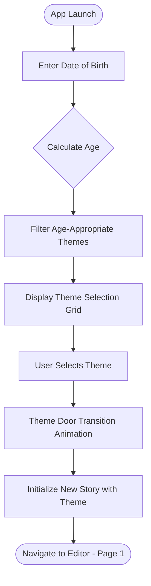
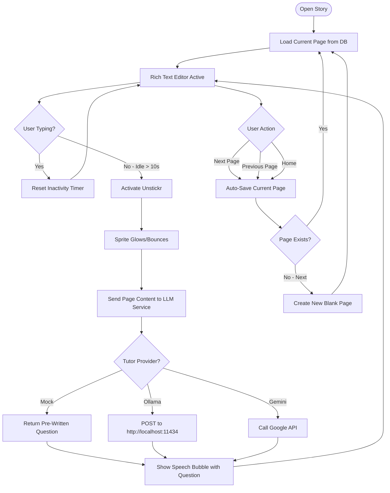
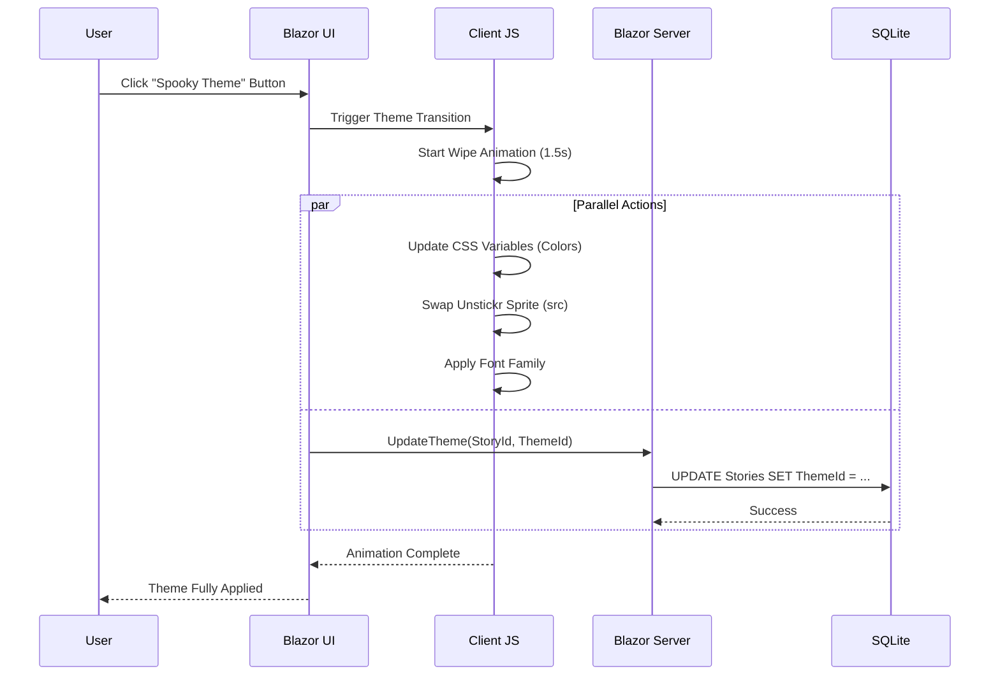
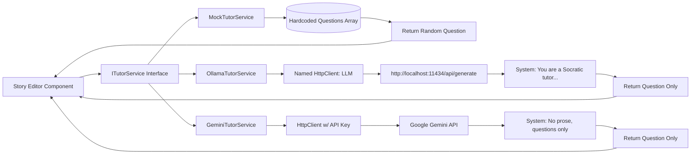
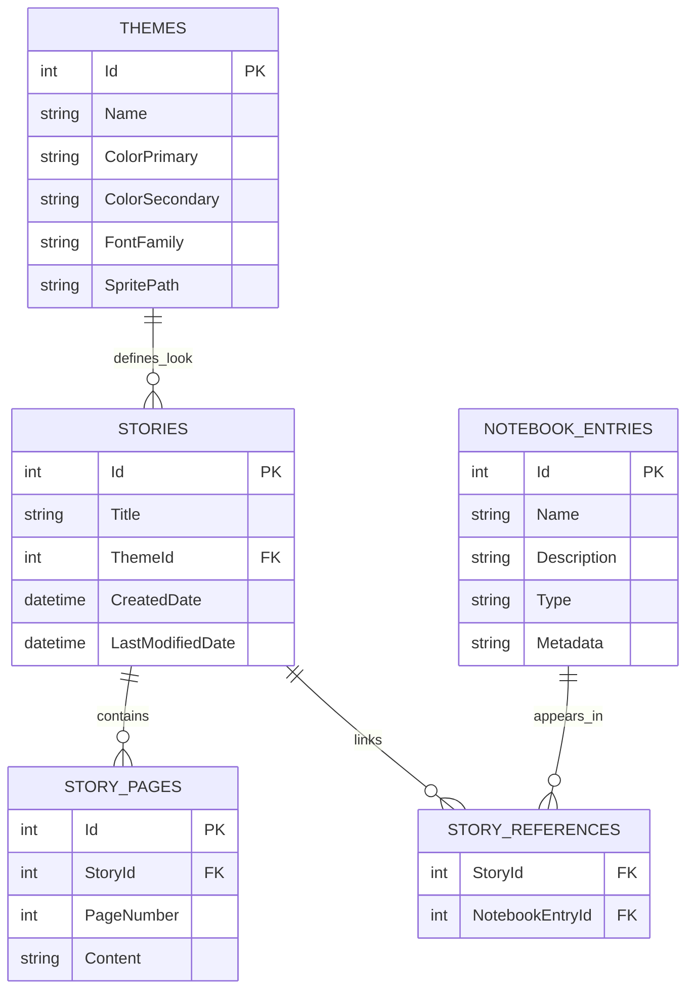
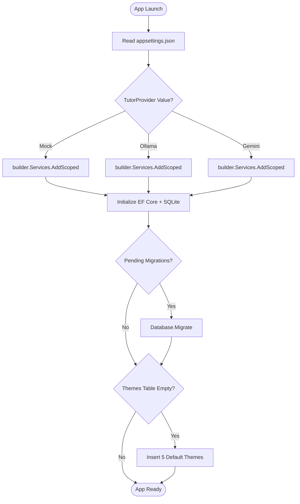

# Unstickd: Workflow Diagrams

This document contains Mermaid diagrams illustrating the key user flows and system interactions.

---

## 1. Onboarding Flow



---

## 2. Story Editing Session



---

## 3. Theme Switching Flow



---

## 4. Notebook Entity Management

```mermaid
flowchart TD
    Start([Navigate to /characters]) --> ListPage[Display Character List]
    ListPage --> UserAction{User Action}
    
    UserAction -->|Create New| Form[Show Character Form]
    Form --> FillFields[User Enters Name, Description]
    FillFields --> Submit[Click Save]
    Submit --> SaveDB[(Save to NotebookEntries Table)]
    SaveDB --> ListPage
    
    UserAction -->|View Details| ShowChar[Display Character Card]
    ShowChar --> QueryLinks[Query StoryReferences Join Table]
    QueryLinks --> DisplayStories[Show: "Appears in Story A, Story B"]
    DisplayStories --> OptionLink{User Action}
    
    OptionLink -->|Open Story| NavStory([Navigate to Story Editor])
    OptionLink -->|Back| ListPage
    
    UserAction -->|Link to Story| LinkForm[Show Story Selection]
    LinkForm --> SelectStory[User Picks Story]
    SelectStory --> CreateLink[(Insert into StoryReferences)]
    CreateLink --> ListPage
```

---

## 5. LLM Service Architecture



---

## 6. Data Relationships (Entity Diagram)



---

## 7. System Startup & Configuration



---

## Notes
- All diagrams use **Mermaid** syntax compatible with GitHub/VS Code renderers
- Diagrams can be viewed inline in VS Code with Mermaid preview extensions
- For detailed implementation specs, see `requirements.md`
